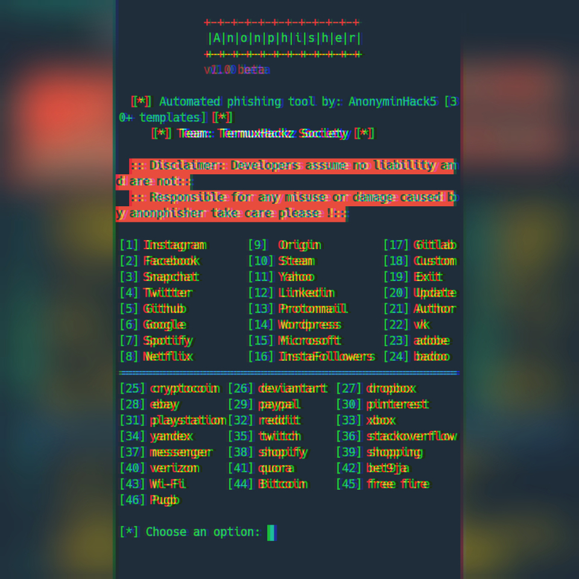

# anonphisher
<p align="center">
<<<<<<< HEAD
Automated phishing tool made by AnonyminHack5 to phish various sites with 40+ templates and also has an inbuilt ngrok already to easily help you generate your link and send it to your victim. 
=======
Automated phishing tool made by AnonyminHack5 to phish various sites with 51+ templates and also has an inbuilt ngrok already to easily help you generate your link and send it to your victim. 
>>>>>>> c4cfa19 (Anonphisher 3.2 beta update)
Anonphisher tool is made with pure bash script and needs required packages for it to work. 
</p>

<h1 align="center">


</h1>

# Anonphisher


# Created by
```
AnonyminHack5 
```

# Tested on
This tool has been tested on the following systems:

[✔] Termux

[✔] Linux

[✔] Windows

[✔] lubuntu

[✔] Ubuntu

[✔] Slax Linux

# Features
<p align="center">
<<<<<<< HEAD
 Phishing Tool for Instagram, Facebook, Twitter, Snapchat, Github, Yahoo, Protonmail, Google, Spotify, Netflix, Linkedin, Wordpress, Origin, Steam, Microsoft, InstaFollowers, fortnite, cod...+30
=======
 Phishing Tool for Instagram, Facebook,  Airbnb, Twitter, Snapchat, Github, Yahoo, Protonmail, Google, Spotify, Netflix, Linkedin, Wordpress, Origin, Steam, Microsoft, InstaFollowers, fortnite, cod...+30
>>>>>>> c4cfa19 (Anonphisher 3.2 beta update)
</p>

# Workflow


# New Features
#### [+] Custom !
#### [+] Pugb free uc phishing page 2021 !
#### [+] Free fire phishing page !
<<<<<<< HEAD
=======
####[+] Airbnb Phishing page !
####[+] CloudFlare 1 and 2 Added for Termux and Linux !
>>>>>>> c4cfa19 (Anonphisher 3.2 beta update)
#### [+] Latest Login Pages !
#### [+] 5 Port Forwarding Options !
#### [+] Easy for Beginners !
#### [+] Wi-fi phishing added! 
#### [+] Facebook free likes phishing page !
#### [+] Fortnite phishing page !
#### [+] Credit card and call of duty phishing pages !

# Credits
<a href="https://t.me/Termux1_bot">Termux1_bot </a>


# Requirements
```
PHP
Wget
Unzip
Curl
Internet connection 
<<<<<<< HEAD
=======
Linux system (RECOMMENDED)
>>>>>>> c4cfa19 (Anonphisher 3.2 beta update)
```

# Wanna encourage us? 
To be able to encourage AnonyminHack5 with he's tools, make sure you use and rate he's <a href="https://t.me/Termux1_bot">Telegram bot</a>


# Installation in Windows
**Open up your terminal and clone the repo**
```
git clone https://github.com/TermuxHackz/anonphisher
cd anonphisher
bash setup
bash anonphisher.sh
```

# Installation in Termux
```
git clone https://github.com/TermuxHackz/anonphisher

cd anonphisher

bash setup

bash install.sh

bash anonphisher.sh
```

## Tunelling Options :
#### > Localhost (127.0.0.1)
#### > NGROK (https://ngrok.com)
#### > SERVEO (https://serveo.net)
#### > LOCALHOSTRUN (https://localhost.run)
#### > LOCALXPOSE (https://localxpose.io/)
<<<<<<< HEAD
=======
#### > CLOUDFLARE (https://cloudflare.com)
>>>>>>> c4cfa19 (Anonphisher 3.2 beta update)


<p>If this is your first time in installing this tool into your termux, Then you must run the <code>bash install.sh </code>And after that dont run it again only run the <code>bash anonphisher.sh </code>
</p>


# Be a White hat ⛑ 🔱🔱 haha😜😜

# Update
Anonphisher tool will be updated monthly so as to make it much more better and also more templates will be added to the tool for you to use. 
To update the tool, run the <b>bash anonphisher.sh </b>and type number 20 from the list of options that appears..Then you can continue the rest yourself...haha

<h4>After you have run the bash install.sh dont run it next time your using it, it will be deleted only run the bash anonphisher.sh ✨✨
</h4>

# Faqs
#### [1] What if i dont see the account info in termux? !
If you do not see the account info in the anonphisher terminal, simply go into the anonphisher logs directory and use the cat command to display the log.
#### [2] Link is not generating? !
Run the bash setup 
Turn on your device hotspot then select ngrok
Of link doesnt still generate, go to ngrok.com, download ngrok, set it up in termux, then copy your authtoken and paste it into your termuxhack home
Then turn on your device hotspot and run ./ngrok http 3333
After go back to the Anonphisher session and select ngrok

# Version
```
<<<<<<< HEAD
Version 3.1 updated
=======
Version 3.2 beta
>>>>>>> c4cfa19 (Anonphisher 3.2 beta update)
```
# Having Issues? 🔍
<b> Send your issues to me personally at AnonyminHack5@protonmail.com 💌 and I will respond to you as quick as I can.</b>
